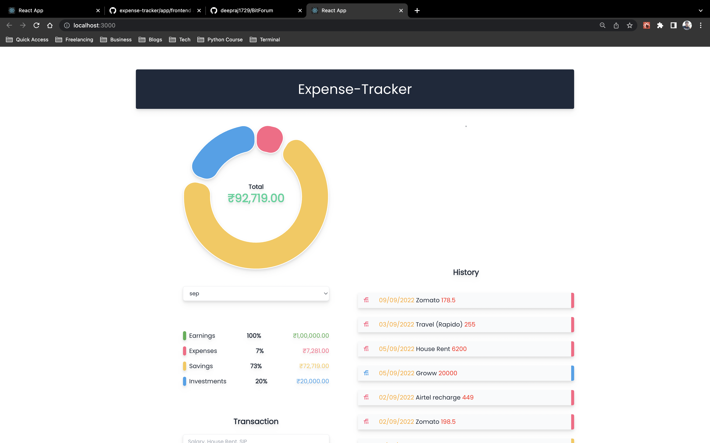
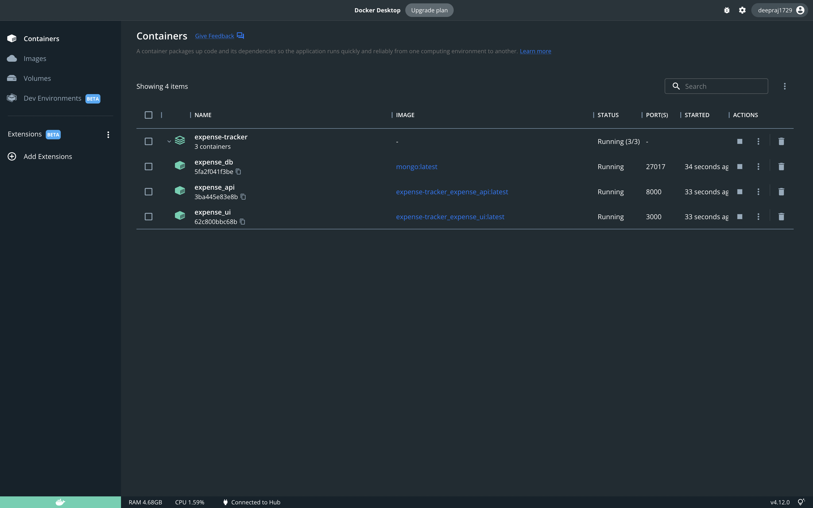

# Expense-Tracker
An expense tracker built with FARM stack (FastAPI,React,MongoDB)

## Requirements
- Docker
- Docker-Compose

## Install and Run
To install and run the application, use `docker-compose` as given below:

1. To build the application (api+db+frontend):

        docker-compose up -d --build

> To make this command easier

        make compose_up

> A demo CLI after running `docker-compose`

2. To delete or remove the containers (api+db):

        docker-compose down

> To make this command easier

        make compose_down

> Shut application

> Running Containers

## Architecture
The architecture of the backend is as follows:

- API Framework: `FastAPI`
- ORM (Object Relational Mapper): `Python Class Abstraction`
- API Query framework: `GraphQL`
- DB: `MongoDB`
- Cache: `Redis`
- CI/CD: `Github Actions`
- Container: `Docker`
- Workflow: `Docker-Compose`
